🎜️ FirePulse+ - AI-Powered Entertainment Hub

Your All-In-One AI Companion for Movie Discovery, Trivia & Watch Parties

🚀 Features

🎞️ Smart Movie & Music Recommendations
Powered by Google Gemini Pro
Tailored suggestions based on mood, time, actor, director, or genre
Analyzes your watch history & Google Calendar events

🤖 AI Trivia Game
Generates unique questions based on your interests
Tracks scores and awards badges for milestones

💬 Live Watch Parties
Real-time rooms powered by WebSockets
Suggests a movie for the group and launches a video meet in one click

📅 Google Calendar Integration
Links with your Google Calendar
Recommends movies for parties, holidays, and other events

📄 Watch Logging & Personalized History
Stores your watched movies
Recommends new ones tailored to your taste

🧰 Tech Stack

🖥️ Frontend
React
Vite
Tailwind CSS

🔧 Backend
FastAPI (Python)
WebSockets for real-time sessions

🗃️ Database
PostgreSQL
SQLAlchemy
Alembic

🔐 Authentication
OAuth 2.0 (Google Login)
JWT Tokens

🌐 APIs
Google Gemini
TMDB
Spotify
Google Calendar

☁️ DevOps & Deployment
AWS Amplify (Frontend)
AWS Lambda (Backend)
Docker (Containerization)

🧠 AI Assistant "Alex" Recommending Movies\Songs

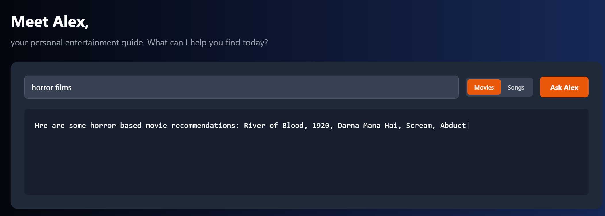

.png)

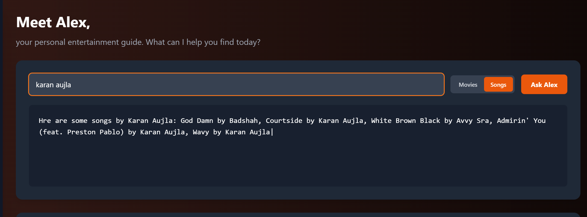

⏱️Time Based Suggestions

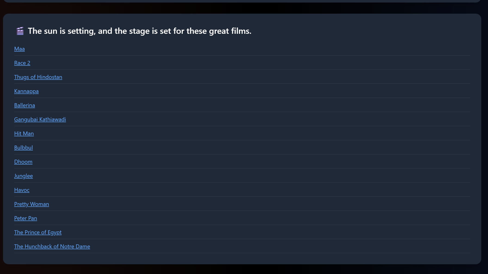

✅History Based Suggestions

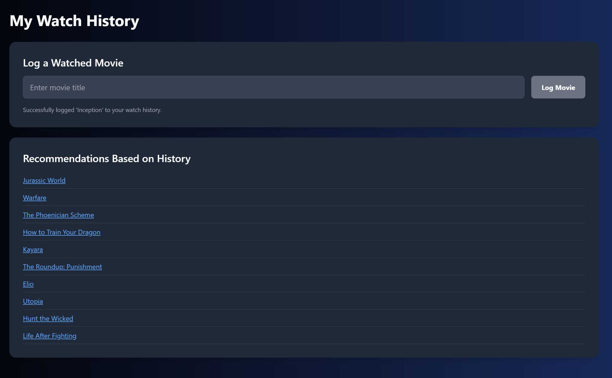

🎉 Personalized AI Trivia Game 

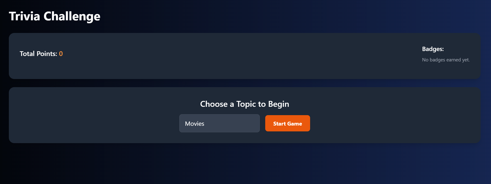

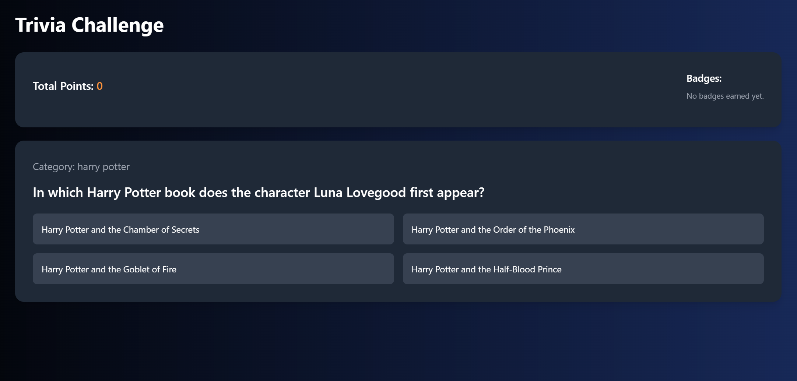

🎃 Calendar-Integrated Movie Suggestions

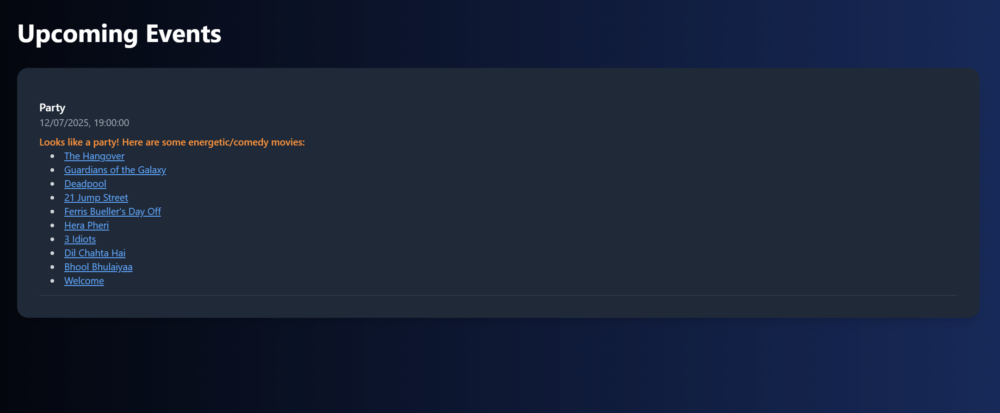

📽 Live Watch Party with AI Suggestions

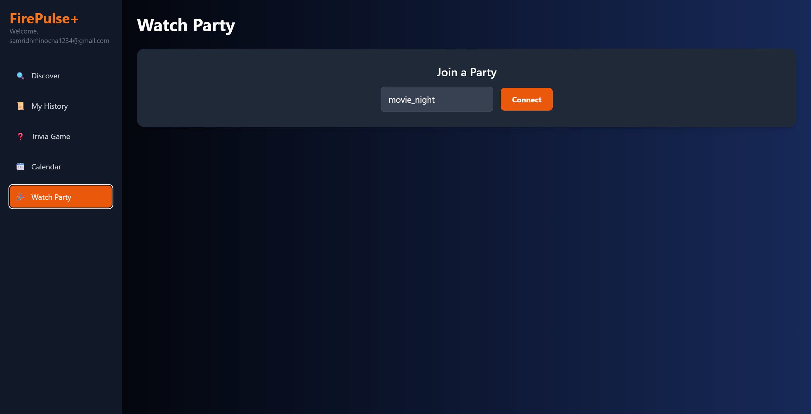

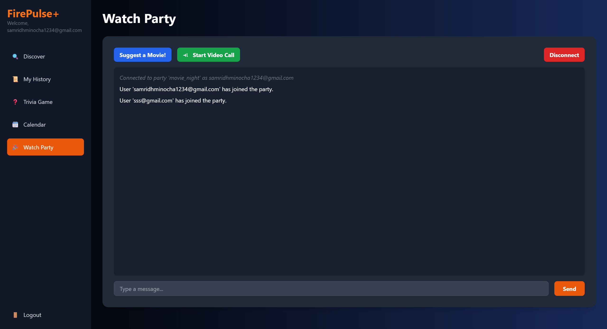

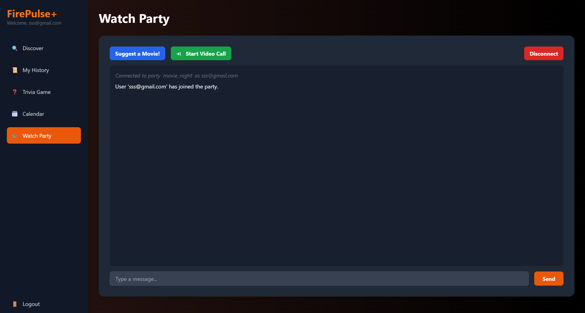

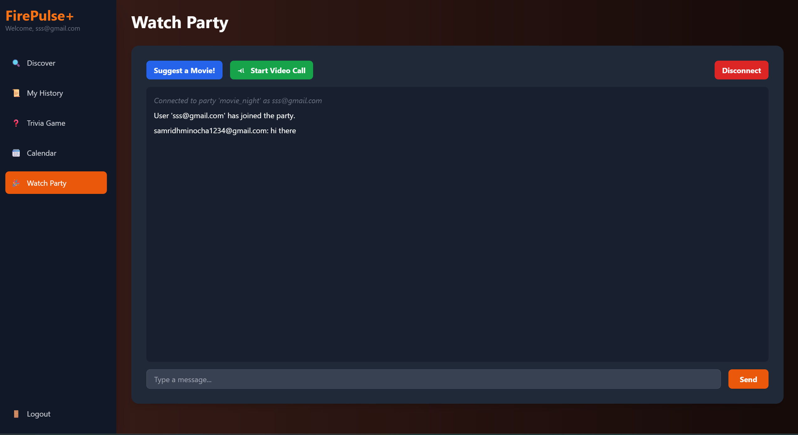

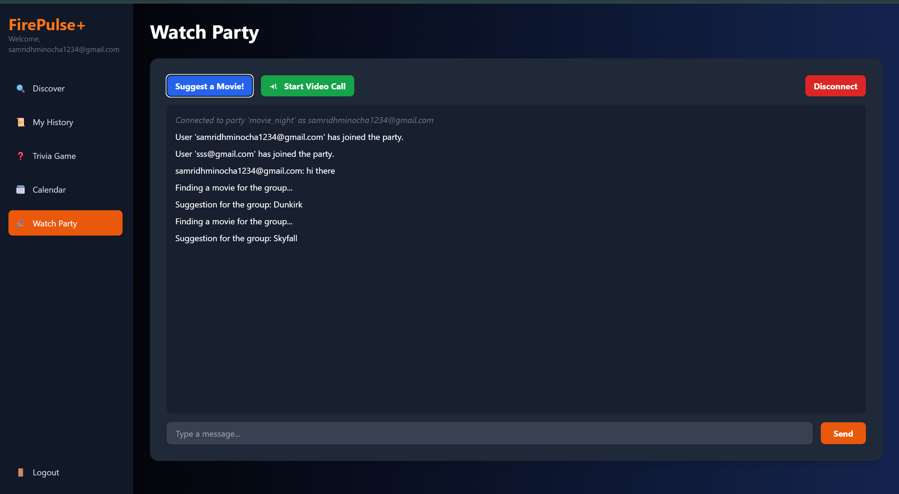

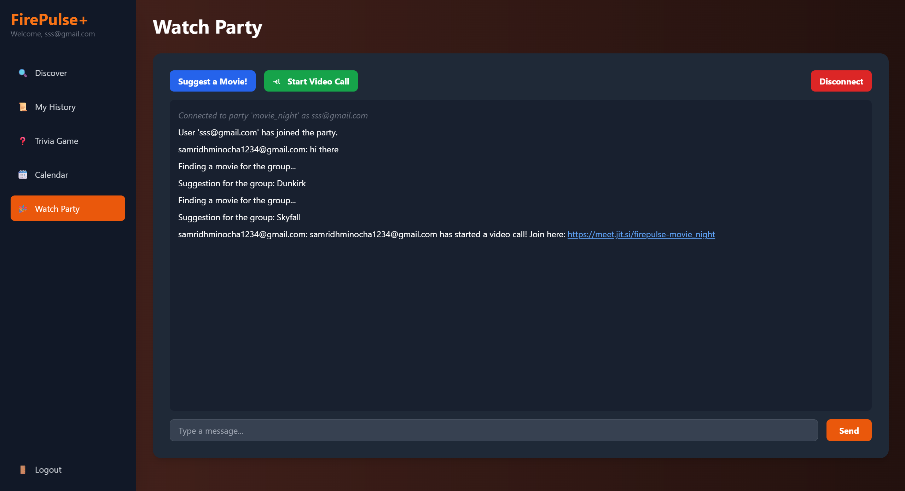

# RUN LOCALLY
# Frontend
cd frontend
npm install
npm run dev

# Backend
cd firepulse
pip install -r requirements.txt
uvicorn main:app --reload

#For .env
TMDB_API_KEY=your_key
SPOTIFY_CLIENT_ID=your_id
SPOTIFY_CLIENT_SECRET=your_secret
GOOGLE_API_KEY=your_api_key
JWT_SECRET_KEY=your_key
JWT_ALGORITHM=your_key
GOOGLE_CLIENT_ID: str=your_key
GOOGLE_CLIENT_SECRET=your_key
GOOGLE_REDIRECT_URI=your_key

📅 Author
Samridh Minocha
📧 samridhminocha2005@gmail.com
